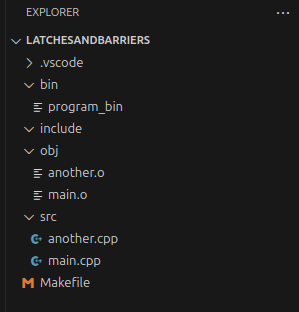

<div style="text-align: center;">


</div>

# cpplayout
Linux based command line utility to make C++ project directories  
  
> Note: You can have your own project structure by replacing "project.tar.gz" with your own archive  

# Installation guide  
Download project.tar.gz and script.sh  
Edit value of ARCHIVE_PATH to where your "project.tar.gz" is in **script.sh** 
```bash
ARCHIVE_PATH="/home/user/Downloads/project.tar.gz"
```
DO NOT DELETE the file after setting value.  
Run the following command
```bash
chmod +x script.sh
sudo cp script.sh /usr/local/bin/cpplayout
```  

# Installation guide (without sudo)
Follow the steps until sudo command.  

```bash
mkdir -p ~/.local/bin
cp script.sh ~/.local/bin/cpplayout
```   
Open your ~/.bashrc file and append the following line at the bottom of the file  
```bash
export PATH="$HOME/.local/bin:$PATH"
```
You can restart the terminal or 
```bash
source ~/.bashrc
```  

You should be able to make new C++ projects using   
```bash
cpplayout
```
